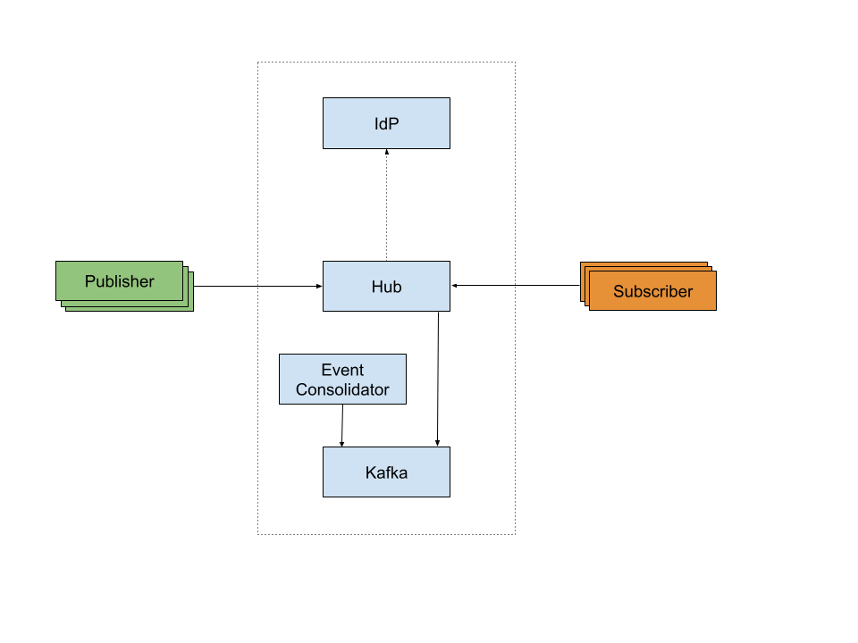

# WebSub Service

[](https://github.com/mosip/websub/actions/workflows/push-trigger.yml)
[](https://sonarcloud.io/dashboard?branch=release-1.3.1&id=mosip_websub)

## Overview
The **WebSub module** implements MOSIP’s publish–subscribe messaging model, enabling secure, scalable, and efficient event distribution across services. It provides:
- Topic registration
- Publish/Subscribe operations
- Message persistence and recovery
- Subscriber retry handling
- OAuth2/JWT-based authentication
- Kafka-backed scalability

For more information, refer to the [MOSIP WebSub documentation](https://nayakrounak.gitbook.io/mosip-docs/modules/websub).

## Technical Features
- Register, publish, subscribe, unsubscribe operations  
- Persistent state storage  
- Delivery retries on subscriber failures  
- Authentication & authorization via IdP  
- Kafka-based horizontal scalability  

## Architecture


## Security
Uses:
- TLS/SSL  
- OAuth2  
- JWT-based validation  
- IdP-backed authentication  

## Services Included
1. **Hub Service** – Event distributor  
2. **Event Consolidator** – Aggregates and manages events  

---

# Local Setup

## Prerequisites
- Ballerina (latest)  
- Apache Kafka  
- Identity Provider (IdP)  
- Docker (optional)

## Required Configuration
## 1. Security
```
SECURITY_ON = true
```

## 2. Kafka Configuration
```
KAFKA_BOOTSTRAP_NODE = "kafka.${kafka.profile}:${kafka.port}"
REGISTERED_WEBSUB_TOPICS_TOPIC = "registered-websub-topics"
CONSOLIDATED_WEBSUB_TOPICS_TOPIC = "consolidated-websub-topics"
WEBSUB_SUBSCRIBERS_TOPIC = "registered-websub-subscribers"
CONSOLIDATED_WEBSUB_SUBSCRIBERS_TOPIC = "consolidated-websub-subscribers"
META_TOPICS = "registered-websub-topics,consolidated-websub-topics,registered-websub-subscribers,consolidated-websub-subscribers"
```

## 3. Hub Runtime
```
SERVER_ID = "server-1"
HUB_PORT = 9191
```

## 4. Message Delivery & Retry
```
MESSAGE_DELIVERY_RETRY_INTERVAL = 3.0
MESSAGE_DELIVERY_COUNT = 3
MESSAGE_DELIVERY_TIMEOUT = 60.0
```

## 5. IDP Authentication
```
MOSIP_AUTH_BASE_URL = "${mosip.kernel.authmanager.url}/v1/authmanager"
MOSIP_AUTH_VALIDATE_TOKEN_URL = "/authorize/admin/validateToken"
```

---

# Running WebSub

## 1. Start Kafka
```sh
./bin/zookeeper-server-start.sh config/zookeeper.properties
./bin/kafka-server-start.sh config/server.properties
```

## 2. Start Identity Provider
Configure the two auth URLs in WebSub config.

## 3. Start Consolidator

### Using Docker
```sh
docker pull mosipdev/consolidator-websub-service
docker run -e consolidator_config_file_url_env=<config-url> ...
```

### Local Ballerina Build
```sh
cd consolidator
bal build
bal run target/bin/consolidator.jar
```

## 4. Start Hub

### Using Docker
```sh
docker pull mosipdev/websub-service
docker run -e hub_config_file_url_env=<config-url> ...
```

### Local Ballerina Build
```sh
cd hub
bal build
bal run target/bin/hub.jar
```

After setup, use the [kernel-websubclient-api](https://github.com/mosip/commons/tree/master/kernel/kernel-websubclient-api) to interact with the Hub.

---

# Usage

## Register Topic
Clients may register topics using the WebSub client API.

## Subscribe
Performs intent verification and content validation automatically.

## Publish
Validated content is delivered to subscribers with retry mechanisms.

---

# Troubleshooting Guide

## 1. Kafka Topics Verification
WebSub creates:

```
registered-websub-topics
consolidated-websub-topics
registered-websub-subscribers
consolidated-websub-subscribers
```

Check:
```sh
kafka-topics.sh --list --bootstrap-server localhost:9092 | grep <topic>
```

## 2. Subscriber Not Receiving Messages

### Check Publish
```sh
grep "Received publish message" | grep <topic>
```

### Verify Subscriber Registration
```sh
kafka-console-consumer.sh --topic consolidated-websub-subscribers --from-beginning --bootstrap-server localhost:9092
```

### Check Delivery Flow
```sh
grep <callback-url> | grep <topic>
```

### Check Invalid Subscriber
```sh
kafka-consumer-groups.sh --describe --group <group> --bootstrap-server localhost:9092
```

If lag exists and subscriber returns non-200 status, it becomes inactive.

---

# Documentation
- WebSub Docs: https://nayakrounak.gitbook.io/mosip-docs/modules/websub  
- API Client: https://github.com/mosip/commons/tree/master/kernel/kernel-websubclient-api  

# Contribution & Community
- Code contributions: https://docs.mosip.io/1.2.0/community/code-contributions  
- Community portal: https://community.mosip.io/  
- Issues: https://github.com/mosip/websub/issues  

# License
Licensed under **Mozilla Public License 2.0**.
